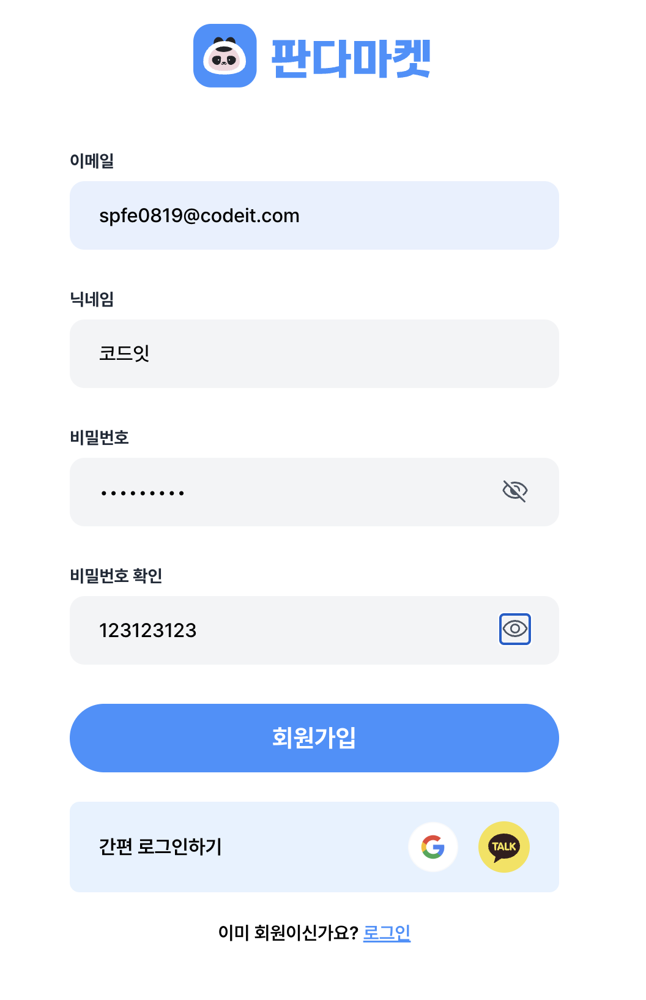
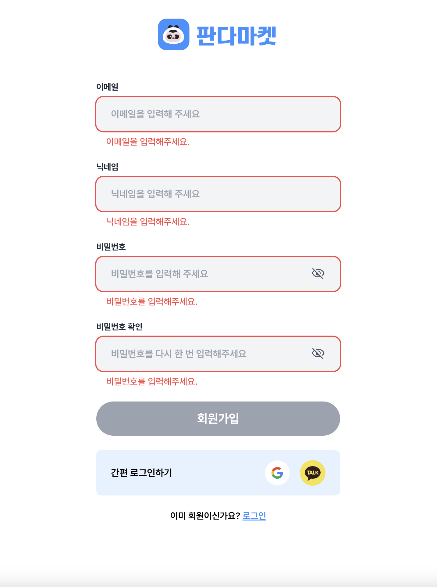

# 판다마켓

사이트주소: https://pandamarket-momo.netlify.app/

## 요구사항
- [x] React와 같은 UI 라이브러리를 사용하지 않고 진행합니다.
- [x] 피그마 디자인에 맞게 페이지를 만들어 주세요.
- [x] Github에 PR(Pull Request)을 만들어서 미션을 제출합니다.

### 기본

로그인
- [x] 활성화된 ‘로그인’ 버튼을 누르면 “/items” 로 이동합니다
- [x] input 에 유효한 값을 입력하면 ‘로그인' 버튼이 활성화 됩니다.
- [x] input 에 빈 값이 있거나 에러 메세지가 있으면 ‘로그인’ 버튼은 비활성화 됩니다.
- [x] 비밀번호 input에서 focus out 할 때, 값이 8자 미만일 경우 아래에 “비밀번호를 8자 이상 입력해주세요.” 에러 메세지를 보입니다.
- [x] 비밀번호 input에서 focus out 할 때, 값이 없을 경우 아래에 “비밀번호를 입력해주세요.” 에러 메세지를 보입니다
- [x] 이메일 input에서 focus out 할 때, 이메일 형식에 맞지 않는 경우 input에 빨강색 테두리와 아래에 “잘못된 이메일 형식입니다” 빨강색 에러 메세지를 보입니다.
- [x] 이메일 input에서 focus out 할 때, 값이 없을 경우 input에 빨강색 테두리와 아래에 “이메일을 입력해주세요.” 빨강색 에러 메세지를 보입니다.
회원가입
- [x] 이메일 input에서 focus out 할 때, 값이 없을 경우 input에 빨강색 테두리와 아래에 “이메일을 입력해주세요.” 빨강색 에러 메세지를 보입니다.
- [x] 이메일 input에서 focus out 할 때, 이메일 형식에 맞지 않는 경우 input에 빨강색 테두리와 아래에 “잘못된 이메일 형식입니다” 빨강색 에러 메세지를 보입니다.
- [x] 닉네임 input에서 focus out 할 때, 값이 없을 경우 input에 빨강색 테두리와 아래에 “닉네임을 입력해주세요.” 빨강색 에러 메세지를 보입니다.
- [x] 비밀번호 input에서 focus out 할 때, 값이 없을 경우 아래에 “비밀번호를 입력해주세요.” 에러 메세지를 보입니다
- [x] 비밀번호 input에서 focus out 할 때, 값이 8자 미만일 경우 아래에 “비밀번호를 8자 이상 입력해주세요.” 에러 메세지를 보입니다.
- [x] 비밀번호 input과 비밀번호 확인 input의 값이 다른 경우, 비밀번호 확인 input 아래에 “비밀번호가 일치하지 않습니다..” 에러 메세지를 보입니다.
- [x] input 에 유효한 값을 입력하면 ‘회원가입' 버튼이 활성화 됩니다.
- [x] 활성화된 ‘회원가입’ 버튼을 누르면 “/signup” 로 이동합니다
- [x] input 에 빈 값이 있거나 에러 메세지가 있으면 ‘회원가입’ 버튼은 비활성화 됩니다.

## 심화
- [x] 눈 모양 아이콘 클릭시 비밀번호의 문자열이 보이기도 하고, 가려지기도 합니다.
- [x] 비밀번호의 문자열이 가려질 때는 눈 모양 아이콘에는 사선이 그어져있고, 비밀번호의 문자열이 보일 때는 사선이 없는 눈 모양 아이콘이 보이도록 합니다.

## 스타일 관련
```
//scss 변환
sass --watch assets/scss/style.scss assets/css/style.css 
```
## 스크린샷


 

## 멘토에게

- form-validation js 두가지 버전으로 코드 시도 해보았습니다.
- 기능에 아쉬움이 있습니다.