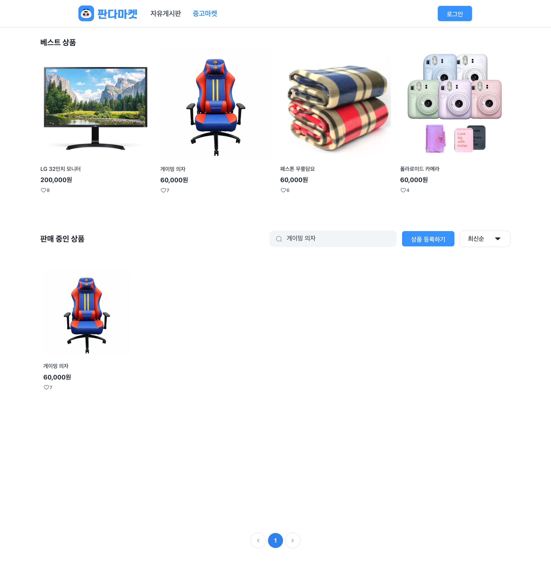

## 요구사항

### 체크리스트 [기본]

#### 중고마켓

- [x] 중고마켓 페이지 주소는 “/items” 입니다.
- [x] 페이지 주소가 “/items” 일때 상단네비게이션바의 '중고마켓' 버튼의 색상은 “3692FF”입니다.
- [x] 상단 네비게이션 바는 이전 미션에서 구현한 랜딩 페이지와 동일한 스타일로 만들어 주세요.
- [x] 상품 데이터 정보는 https://panda-market-api.vercel.app/docs/#/ 에 명세된 GET 메소드 “/products” 를 사용해주세요.
- [x] '상품 등록하기' 버튼을 누르면 “/additem” 로 이동합니다. ( 빈 페이지 )
- [x] 전체 상품에서 드롭 다운으로 “최신 순” 또는 “좋아요 순”을 선택해서 정렬을 할 수 있습니다.

#### 중고마켓 반응형

- [x] 베스트 상품
  - Desktop : 4개 보이기
  - Tablet : 2개 보이기
  - Mobile : 1개 보이기
- [x] 전체 상품
  - Desktop : 12개 보이기
  - Tablet : 6개 보이기
  - Mobile : 4개 보이기

#### 체크리스트 [심화]

- [x] 페이지 네이션 기능을 구현합니다.

## 스크린샷

## 멘토에게

- 반응형
  - 판매 중인 상품 탭에 싱품바로가기 버튼 있는 곳의 반응형 레이아웃을 어떤식으로 하면 좋을지 모르겠습니다
- 기능
  - 컴포넌트도 SOLID 원칙에 따라 구분해놓으면 좋을까요??
  - 현업에서 페이지 당 상태와 기능을 어떤식으로 관리하는지 궁금합니다
